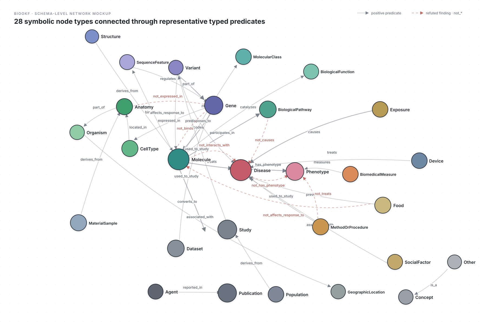
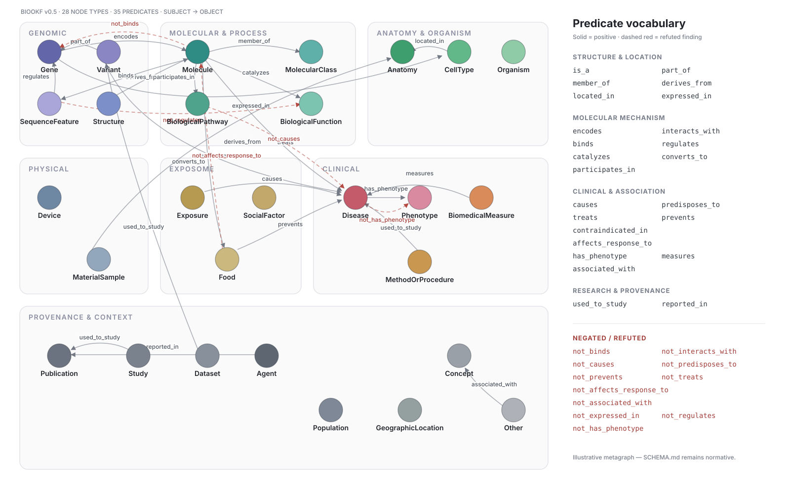

# BioOKF metagraph

An illustrative, machine-valid BioOKF bundle in which each controlled node type is
represented by an archetype node. The edges show plausible type-to-type uses of all 24
positive predicates and all 11 canonical negative predicates. This is a compact design
map, not a replacement for the normative domain/range guidance in `SCHEMA.md`.

`Phenotype (alternative)` is a second Phenotype instance used only to demonstrate
`not_has_phenotype` without asserting both polarities for the same subject/object pair.

## Network mockup

## Complete predicate overview

<!-- bokf:index:start -->
## Identifier registry

| identifier | type | subtype | description |
|---|---|---|---|
| Agent | Agent | metatype | Archetype for people, laboratories, organizations, companies, and regulators. |
| Anatomy | Anatomy | metatype | Archetype for organs, tissues, body regions, organelles, and fluids. |
| BiologicalFunction | BiologicalFunction | metatype | Archetype for molecular functions. |
| BiologicalPathway | BiologicalPathway | metatype | Archetype for pathways, reactions, signaling cascades, and biological processes. |
| BiomedicalMeasure | BiomedicalMeasure | metatype | Archetype for measurable variables, biomarkers, tests, scores, and readouts. |
| CellType | CellType | metatype | Archetype for cell types, states, lines, and organoids. |
| Concept | Concept | metatype | Archetype for classifications, units, ontology terms, and abstract concepts. |
| Dataset | Dataset | metatype | Archetype for tables, matrices, image collections, and knowledge bases. |
| Device | Device | metatype | Archetype for devices, implants, instruments, reagents, and kits. |
| Disease | Disease | metatype | Archetype for diagnosed disorders and conditions. |
| Exposure | Exposure | metatype | Archetype for behavioral, environmental, occupational, and dietary exposures. |
| Food | Food | metatype | Archetype for food items, food groups, and dietary products. |
| Gene | Gene | metatype | Archetype for genes and heritable loci. |
| GeographicLocation | GeographicLocation | metatype | Archetype for countries, regions, and places. |
| MaterialSample | MaterialSample | metatype | Archetype for biospecimens and material samples. |
| MethodOrProcedure | MethodOrProcedure | metatype | Archetype for procedures, assays, software, models, protocols, and statistical m |
| MolecularClass | MolecularClass | metatype | Archetype for molecule families and pharmacological or chemical classes. |
| Molecule | Molecule | metatype | Archetype for proteins, drugs, metabolites, complexes, ions, and RNA species. |
| Organism | Organism | metatype | Archetype for species, strains, pathogens, and microbes. |
| Other | Other | metatype | Metagraph fallback archetype. |
| Phenotype | Phenotype | metatype | Archetype for signs, symptoms, traits, and side effects. |
| Phenotype (alternative) | Phenotype | metatype | Second instance used to demonstrate a negative phenotype finding without contrad |
| Population | Population | metatype | Archetype for cohorts, ancestry groups, and demographic populations. |
| Publication | Publication | schema_document | Archetype for papers, preprints, notes, and other citable documents. |
| SequenceFeature | SequenceFeature | metatype | Archetype for reference functional and regulatory elements. |
| SocialFactor | SocialFactor | metatype | Archetype for social determinants and contextual factors affecting health. |
| Structure | Structure | metatype | Archetype for resolved or predicted three-dimensional structures. |
| Study | Study | metatype | Archetype for trials, cohorts, registries, and association studies. |
| Variant | Variant | metatype | Archetype for deviations from a reference sequence. |

## By type

- **Agent** (1): Agent
- **Anatomy** (1): Anatomy
- **BiologicalFunction** (1): BiologicalFunction
- **BiologicalPathway** (1): BiologicalPathway
- **BiomedicalMeasure** (1): BiomedicalMeasure
- **CellType** (1): CellType
- **Concept** (1): Concept
- **Dataset** (1): Dataset
- **Device** (1): Device
- **Disease** (1): Disease
- **Exposure** (1): Exposure
- **Food** (1): Food
- **Gene** (1): Gene
- **GeographicLocation** (1): GeographicLocation
- **MaterialSample** (1): MaterialSample
- **MethodOrProcedure** (1): MethodOrProcedure
- **MolecularClass** (1): MolecularClass
- **Molecule** (1): Molecule
- **Organism** (1): Organism
- **Other** (1): Other
- **Phenotype** (2): Phenotype, Phenotype (alternative)
- **Population** (1): Population
- **Publication** (1): Publication
- **SequenceFeature** (1): SequenceFeature
- **SocialFactor** (1): SocialFactor
- **Structure** (1): Structure
- **Study** (1): Study
- **Variant** (1): Variant

## Subtypes in use

- **Agent**: metatype
- **Anatomy**: metatype
- **BiologicalFunction**: metatype
- **BiologicalPathway**: metatype
- **BiomedicalMeasure**: metatype
- **CellType**: metatype
- **Concept**: metatype
- **Dataset**: metatype
- **Device**: metatype
- **Disease**: metatype
- **Exposure**: metatype
- **Food**: metatype
- **Gene**: metatype
- **GeographicLocation**: metatype
- **MaterialSample**: metatype
- **MethodOrProcedure**: metatype
- **MolecularClass**: metatype
- **Molecule**: metatype
- **Organism**: metatype
- **Other**: metatype
- **Phenotype**: metatype
- **Population**: metatype
- **Publication**: schema_document
- **SequenceFeature**: metatype
- **SocialFactor**: metatype
- **Structure**: metatype
- **Study**: metatype
- **Variant**: metatype
<!-- bokf:index:end -->
