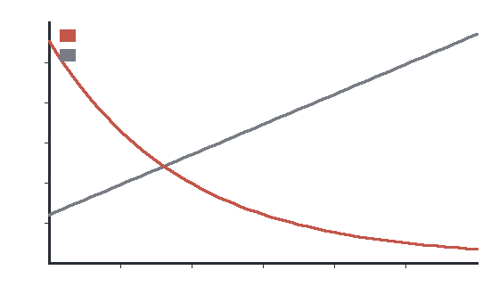

# Statins induce colorectal tumor regression (preprint)

> **RETRACTED.** This preprint was withdrawn after the primary tumor-measurement data could not be
> reproduced. It is retained here only to exercise the UI's credibility / retraction flagging.

A single-arm study claimed dramatic tumor-volume reduction with high-dose atorvastatin.

*Figure 1. Reported tumor volume under atorvastatin (red) versus control (grey).*
