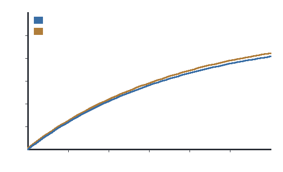

# Statins and colorectal-cancer risk: a prospective cohort

Among 132,000 adults followed for a median of 9.4 years, statin use was **not associated** with
colorectal-cancer incidence (adjusted relative risk 0.98, 95% CI 0.90–1.07; p = 0.62).

*Figure 1. Cumulative colorectal-cancer incidence in statin users (blue) versus non-users (orange).
The curves overlap throughout follow-up, consistent with no protective effect.*

## Methods
Prospective cohort; Cox models adjusted for age, sex, BMI, smoking, and family history.
